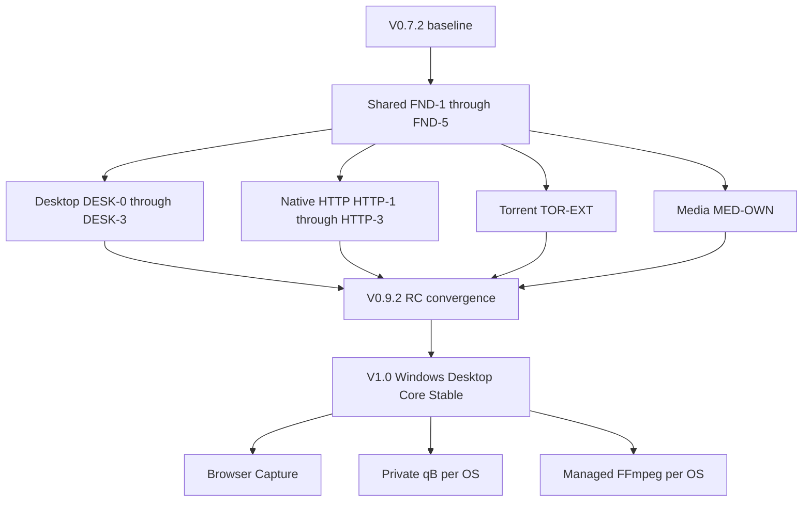
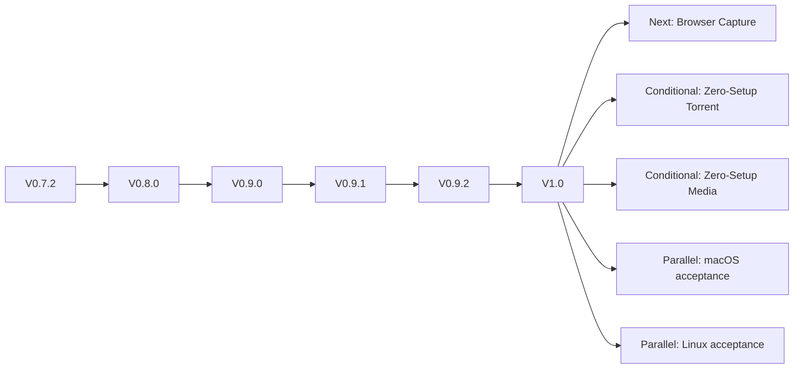

# GoDownloader Engineering Roadmap

This document is the engineering and product roadmap source of truth for GoDownloader. It describes integrated product releases and the independent work tracks that feed them. It is intentionally not a forensic report, ADR collection, package design, or exhaustive test plan.

Roadmap markers:

- **DONE** — delivered in the current product baseline.
- **PLANNED** — approved future integrated release work.
- **GATED** — requires an explicit spike, acceptance result, or owner decision.
- **CONDITIONAL** — applies only to a named platform or capability after its gate passes.
- **DEFERRED** — deliberately outside the near-term roadmap.

## Current Baseline

| Field | Current truth |
|---|---|
| Branch | `main` |
| Research-pinned baseline | `8ae063e7189da0fd4a0c0a9d20002178924d897d` |
| Delivered through | V0.7.2 |
| Product form | Go + React local web application with SQLite and external transfer/media engines |

The SHA is the architecture and roadmap research baseline. It is not a promise that later roadmap-documentation commits or implementation work will retain the same `HEAD`.

## Delivered History

| Version | Delivered scope | Status |
|---|---|---|
| V0.1 | Direct HTTP through aria2, SQLite, REST and SSE | **DONE** |
| V0.2 | yt-dlp media extraction/analysis and FFmpeg muxing | **DONE** |
| V0.3 | React SPA, live dashboard and format selection | **DONE** |
| V0.4 | qB WebAPI, magnets/torrents, metadata/file selection and seeding | **DONE** |
| V0.5 | Persistent priority queue, concurrency, batch and bulk actions | **DONE** |
| V0.6 | Storage categories, disk preflight, conflict policy and safe deletion | **DONE** |
| V0.7 | Bandwidth/proxy controls, AES-GCM secret records and trackers | **DONE** |
| V0.7.1 | Authenticated media and encrypted cookie import | **DONE** |
| V0.7.2 | Subtitle discovery, translation and contained sidecar finalization | **DONE** |

Existing web and external-engine modes remain valid migration and support paths until a later explicit decision retires them.

## Product and Release Terminology

| Term | Meaning |
|---|---|
| **DONE** | Delivered in the pinned product baseline. |
| **ENGINEERING GATE** | Internal evidence or infrastructure boundary; not a public version. |
| **EXPERIMENTAL** | Explicit opt-in path whose default/stable acceptance is incomplete. |
| **COMPATIBILITY** | Supported non-default path for legacy or edge-case execution. |
| **PREVIEW** | Deliberately non-stable evaluation build with disclosed gaps. |
| **BETA** | Integrated pre-release suitable for broader validation, with known release gates remaining. |
| **RELEASE CANDIDATE** | Exact release contract is implemented and undergoing final acceptance. |
| **STABLE** | Release-supported state with passed acceptance, support, migration, and rollback paths. |
| **SUPPORTED** | Tested and documented within a named platform, workflow, and dependency envelope. |
| **MANAGED** | GoDownloader acquires, configures, verifies, activates, updates, diagnoses, and rolls back the dependency. |
| **BUNDLED** | The artifact is physically shipped with an application or package; this alone proves neither lifecycle ownership nor distribution approval. |
| **ZERO SETUP** | The named capability needs no separately installed or configured runtime after app installation. |
| **CODE TARGET** | Architecture and shared code target an OS; no product-support claim. |
| **RELEASE-SUPPORTED** | Installer, signing/trust, lifecycle, recovery, update, and support gates passed on that OS. |

These terms are not interchangeable: **SUPPORTED != MANAGED**, **MANAGED != BUNDLED**, **BUNDLED != ZERO SETUP**, and **CODE TARGET != RELEASE-SUPPORTED**.

## V1.0 Product Contract

### GoDownloader V1.0 — Windows Desktop Core Stable

V1.0 requires:

- a Windows release-supported desktop application;
- an accepted Wails v3 shell or approved Tauri v2 fallback, embedding the existing React UI;
- one authoritative GoDownloader instance per data root;
- typed IPC and events, with the shell never reading SQLite or controlling engines directly;
- tray, background, single-instance, and bounded quit lifecycle;
- native Go HTTP as `DEFAULT` inside the validated compatibility envelope;
- aria2 as optional `COMPATIBILITY`;
- durable execution, checkpoints, finalization, and reconciliation;
- an OS-protected master key with no plaintext desktop fallback;
- managed, verified yt-dlp;
- configured external qB for torrent support;
- compatible system/user FFmpeg for workflows that require it;
- a production signed automatic updater; and
- a signed Windows installer with a support and rollback path.

**V1 IS NOT A FULL ZERO-DEPENDENCY TORRENT/MEDIA PRODUCT.**

| V1 capability | Zero-setup result |
|---|---|
| App installation | **YES** |
| Direct HTTP | **YES**, inside the validated native envelope |
| Torrent | **NO** — external qB is required |
| Media analysis | **YES** — yt-dlp is managed by GoDownloader |
| FFmpeg-dependent processing | **NO** — compatible external FFmpeg is required |
| Browser capture | **NO** — post-V1 |
| macOS stable | **NO** |
| Linux stable | **NO** |

## Public Distribution Gate

**OWNER / RELEASE GATE:** GoDownloader's formal project license and provenance posture must be established before **ANY PUBLIC REDISTRIBUTABLE GODOWNLOADER BUILD**.

This includes:

- public Preview;
- public Beta;
- public Release Candidate; and
- public Stable releases.

It does not prevent private local development, private internal engineering builds, or private spike artifacts. This roadmap does not choose the license.

## Engineering Work Tracks

These tracks run independently and in parallel after shared foundations. Product versions are integration and acceptance points, not a strictly serial implementation Gantt chart.

| Track | Scope | Integration points |
|---|---|---|
| Foundation | Durable schema, recovery/finalization, StateSync, security, tool/process ownership, scheduler/governor | V0.8.0 and every later production activation |
| Desktop | Framework-neutral contracts, shell, single instance, IPC/events, lifecycle, packaging | V0.9.0–V0.9.2 |
| Native HTTP | Compatibility evidence, execution/checkpoints, ranges/resume, budgets, default readiness | V0.9.2/V1.0 |
| Torrent | External qB ownership and shared-daemon safety; later private qB per OS | V0.9.1 and post-V1 capability gates |
| Media | Managed yt-dlp, durable stages, process/resource ownership, external FFmpeg diagnostics | V0.9.1–V0.9.2 |
| Release / Provenance | License, signing, packages, updater, SBOM/notices, support and rollback | V0.9.2/V1.0 |
| Browser | Broker/privacy contracts followed by explicit Native Messaging capture | Post-V1 |

Finishing work inside one track does not create a public release. Tracks converge only at the applicable product acceptance point.

## Canonical Spikes and Decision Gates

### Pre-V1 Critical

| Gate | Decision |
|---|---|
| `SPK-SYN3-01` — Desktop shell / Wails | Accept Wails v3 production coupling or trigger the recorded Tauri v2 fallback evaluation. |
| `SPK-SYN3-02` — Native HTTP compatibility | Establish the correctness and compatibility envelope required before native HTTP becomes `DEFAULT`. |
| `SPK-SYN3-04` — OS secret provider | Accept the Windows OS-protected key provider before persistent desktop-secret activation. |
| `SPK-SYN3-06` — Updates | Prove authenticated, interruption-safe application update and rollback behavior. |
| `SPK-SYN3-07` — Process-tree ownership | Prove safe child/grandchild supervision before stable app-owned process claims. |

### Post-V1 / Capability Gates

| Gate | Decision |
|---|---|
| `SPK-SYN3-03` — Private qB per OS | Required only for a private managed qB and zero-setup torrent claim on that OS. |
| `SPK-SYN3-05` — Browser Native Messaging | Required only for a browser companion release. |
| Managed FFmpeg provenance/build gate | Required only for a managed FFmpeg and corresponding zero-setup media claim. |

A post-V1 spike may run early. “Post-V1” means its result is not required for V1, not that investigation must wait.

## Foundation Engineering Gates

The five foundation gates are internal engineering gates, **not five public versions**. They integrate into V0.8.0.

| Gate | Scope |
|---|---|
| `FND-1` — Durable execution schema | Execution identity, engine/tool binding, checkpoints, event cursor, finalization, retry and resource records; migration from real V0.7.2 fixtures. |
| `FND-2` — Recovery / FinalizationJournal / StateSync | Journaled artifact transitions, conservative reconciliation, snapshot/cursor/bounded replay and rehydration. |
| `FND-3` — Security / authenticated local surfaces / OS key | Bounded authenticated REST/SSE, Origin/CSRF/PNA policy, redaction and accepted OS key provider. |
| `FND-4` — ToolManager / ProcessSupervisor | Verified tool ledger, activation and last-known-good rollback; process identity, health, logs and tree control. |
| `FND-5` — Scheduler aging / initial ResourceGovernor | Priority aging, Run Now, deterministic restart, admission and explainable waits. |

The initial `ResourceGovernor` covers global transfers, per-engine transfers, disk reservation, media analysis/download slots, FFmpeg processing slots, seeding capacity, and explainable waits. Memory pressure is soft initially. Native HTTP owns per-host, per-download, and global HTTP connection budgets. CPU affinity is deferred.

## Native HTTP Track

| Milestone | Scope | Activation |
|---|---|---|
| `HTTP-1` — Experimental Core | Probe and remote identity, safe single-stream execution, staging, positional-writer/checkpoint foundation. | `OFF`, then explicit `EXPERIMENTAL` |
| `HTTP-2` — Range / Resume Candidate | Correct range negotiation, fixed non-overlapping ranges, validator-based resume, retry/backoff/accounting, and safe fallback. | Experimental candidate |
| `HTTP-3` — Default Readiness | Compatibility matrix, crash recovery, finalization, resource budgets, proxy/auth/redirect/network policy, telemetry and support evidence. | `DEFAULT` only after all correctness gates pass |
| `HTTP-OPT` — Optimization | Measured slow start, dynamic safe-zone splitting, tail stealing, and later connection visualization/telemetry if justified. | Optional follow-up |

`HTTP-OPT` does **not** block native HTTP becoming `DEFAULT`; correctness does.

### HTTP Migration Rules

- Native HTTP moves through `OFF` → `EXPERIMENTAL` → `DEFAULT`.
- aria2 remains `COMPATIBILITY`.
- Engine family and checkpoint version are persisted per Job.
- Changing the global default affects only new eligible Jobs.
- aria2 Jobs remain aria2 Jobs; native Jobs remain native Jobs.
- Active Jobs never switch engine family silently.
- Checkpoint formats are never mixed.
- Cross-engine fallback is selected before transfer or requires an explicit safe selection/restart.

### aria2 Role

aria2 remains an optional compatibility and transition engine. Investment is limited to secure loopback RPC, secret handling, session/correlation, health, graceful shutdown, and diagnostics. This roadmap does not create a universal aria2 bundling program or delete aria2 compatibility.

## Desktop Track

| Milestone | Scope |
|---|---|
| `DESK-0` — Framework-neutral contracts | React transport abstraction, StateSync consumer, typed command/event DTOs, instance and lifecycle contracts, accessibility and packaging fixtures. |
| `DESK-1` — Shell Preview | Accepted shell, embedded React/core, single-instance forwarding, native dialogs/notifications, typed IPC/events and development diagnostics. |
| `DESK-2` — Lifecycle / Packaging | Tray/background/quit, opt-in autostart, recovery UX, support bundle, installer fixtures and web-mode fallback. |
| `DESK-3` — Stable Windows Closure | Signing, clean install/upgrade/uninstall, lifecycle, crash/orphan acceptance, updater integration and support closure. |

Wails v3 remains the primary candidate only if `SPK-SYN3-01` passes. Tauri v2 is the recorded fallback. Framework-neutral work may begin before that decision. Desktop preview does not wait for native HTTP `DEFAULT`; it may use aria2 compatibility, external qB, and system FFmpeg with honest diagnostics.

## Torrent Track

### TOR-EXT — ExternalUserManaged qB Hardening

`TOR-EXT` is required before the V1 torrent support claim. It provides:

- explicit external runtime ownership;
- endpoint, version, and capability validation;
- OS-protected credentials;
- durable Job ↔ qB execution/infohash correlation;
- recovery, reattachment, and health diagnostics; and
- shared-daemon-safe, torrent-scoped operations.

Same-infohash handling is locked:

- when durable GoDownloader ownership is proven, reattach;
- when the torrent is external, unowned, or ambiguous, **REFUSE BY DEFAULT**.

GoDownloader must not silently adopt, recategorize, retag, pause, resume, remove, reprioritize, or change file selection for an external torrent.

Daemon-global qB proxy, interface, networking, and other preferences are `UNAVAILABLE IN SHARED MODE` by default. A future global operation would require separate explicit user confirmation. GoDownloader must not mutate those shared-daemon preferences automatically.

### PrivateManaged qB

Private managed qB is **CONDITIONAL** and post-V1. It is gated independently per operating system; no universal implementation is assigned across Windows, macOS, and Linux.

## Media Track

### MED-OWN

Pre-V1 media ownership includes:

- managed, verified yt-dlp with provenance, atomic activation, ToolManager integration, and last-known-good rollback;
- durable analysis, download, processing, and finalization stages;
- authoritative output paths and contained working directories;
- consent-scoped encrypted cookie references, temporary export cleanup, and redaction;
- complete process-tree supervision;
- stage-specific retry/recovery without duplicate progress credit; and
- separate media analysis/download and FFmpeg processing resource slots.

For V1, FFmpeg is system/user provided and must pass version/configuration/capability probes. Missing capabilities produce clear workflow-specific diagnostics. Managed yt-dlp does not imply managed FFmpeg. Managed FFmpeg is a post-V1, per-platform provider/build/provenance/legal/package gate.

## Browser Track

Browser capture is post-V1. The initial target is:

```text
Browser extension
  → Native Messaging
  → minimal native host
  → authenticated local IPC
  → existing GoDownloader instance
```

The first scope is explicit user capture, with Chromium-family browsers first and Firefox as a separate integration path. Automatic interception is deferred.

## Update and Release Track

V1 automatic updating is a locked requirement. The production updater must provide authenticated application-update metadata, platform signing, staging and disk preflight, interruption safety, schema compatibility, rollback, a last-known-good signed installer, and exactly one runnable version after failure.

A signed manual installer is allowed as a Preview or Release Candidate fallback. It does not satisfy V1 `STABLE`; the automatic updater gate must pass first. Application updates and per-tool `ToolManager` transactions remain independent trust and rollback domains.

## Platform Strategy

The architectural target is Windows, macOS, and Linux. Release sequencing is Windows stable first.

macOS and Linux remain `CODE TARGET` and parallel CI/acceptance tracks until they independently pass installer, signing/trust, secret-provider, process, update, recovery, and support acceptance. After V1, whichever platform passes those gates first may be promoted; this roadmap does not predeclare a stable macOS or Linux version.

## Integrated Product Version Sequence

### V0.8.0 — Durable Core Preview — **PLANNED**

Integrates `FND-1` through `FND-5`. The existing web product becomes migration-safe, more recoverable, more secure, and more diagnosable. It makes no desktop support claim.

### V0.9.0 — Windows Desktop Technical Preview — **PLANNED**

Integrates `DESK-0` and `DESK-1` into an installable technical preview. Native HTTP may still be experimental. aria2 compatibility, external qB, user yt-dlp, and system FFmpeg remain valid disclosed dependencies. Web mode remains a fallback.

### V0.9.1 — Windows Desktop Beta — **PLANNED**

Integrates `DESK-2`, `TOR-EXT`, and `MED-OWN`; accepted native HTTP candidate work may also be included. Adds tray/background lifecycle, safer shared-qB ownership, managed yt-dlp, durable media recovery, and beta packaging. External qB and system FFmpeg remain.

### V0.9.2 — Windows Release Candidate — **PLANNED**

Converges `HTTP-3` default readiness, `DESK-3`, the production automatic updater, signing, release/provenance, upgrade/recovery, and support closure. The exact V1 contract must be demonstrably satisfied. Browser capture, private qB, managed FFmpeg, and macOS/Linux stable support remain outside this release.

### V1.0 — Windows Desktop Core Stable — **PLANNED**

Stabilizes and support-promotes the accepted V0.9.2 outputs. It introduces no new dependency program. Claims are limited to the locked V1 contract in this document.

## Version Summary

| Version / Gate | Product Goal | User Outcome | Critical Gates | Dependency Claim |
|---|---|---|---|---|
| FND gates | Establish shared durable, secure ownership contracts | No independent product promise | FND-1–5; SPK04/07 for activation | Existing external engines remain |
| V0.8.0 | Durable Core Preview | Safer, diagnosable existing web product | All FND gates | aria2, qB, yt-dlp, and FFmpeg remain user-managed |
| V0.9.0 | Windows Desktop Technical Preview | Installable shell with typed IPC/events and web fallback | SPK01; accepted Windows OS-key path | Native experimental or aria2; external qB; user tools |
| V0.9.1 | Windows Desktop Beta | Mature lifecycle, safer torrents, managed yt-dlp/media recovery | DESK-2, TOR-EXT, MED-OWN, SPK07 | External qB; system FFmpeg; aria2 if native default is not accepted |
| V0.9.2 | Windows Release Candidate | Exact V1 contract proven on signed Windows builds | HTTP-3, DESK-3, SPK01/02/04/06/07, license/signing | External qB for torrent; system FFmpeg where required; aria2 optional |
| V1.0 | Windows Desktop Core Stable | Stable supported Windows desktop and zero-setup normal HTTP | All pre-V1 and owner/release gates | Managed yt-dlp; external qB and conditional FFmpeg |
| Post-V1 conditional tracks | Add independently accepted capability or OS support | Incremental browser, zero-setup dependency, or platform value | SPK03/05 and exact provider/OS gates | Track-specific; no claim until accepted |

## Engineering Dependency Diagram



Desktop, native HTTP, torrent, and media share foundation contracts but do not wait for one another's feature implementation before running. They converge at Release Candidate acceptance.

## Release Progression Diagram



## Product Claim Table

| Version | Desktop | HTTP | Torrent dependency | Media dependency | Browser | Updater | Platform status |
|---|---|---|---|---|---|---|---|
| V0.8.0 | No desktop release | aria2 normal path | External qB | User yt-dlp; FFmpeg when required | NO | NO | Code target; no desktop support claim |
| V0.9.0 | Technical Preview | Native experimental or aria2 | External qB | User yt-dlp; system FFmpeg | NO | NO | Windows desktop preview; macOS/Linux code targets |
| V0.9.1 | Beta | Native candidate or aria2 | External qB | Managed yt-dlp; system FFmpeg conditional | NO | Preview/internal only | Windows beta; macOS/Linux code targets |
| V0.9.2 | Release Candidate | Native `DEFAULT` within envelope; aria2 compatibility | External qB | Managed yt-dlp; system FFmpeg conditional | NO | YES, after SPK06 | Windows RC; no macOS/Linux support claim |
| V1.0 | **STABLE** | Native `DEFAULT` within envelope | **External qB required** | **Managed yt-dlp; FFmpeg conditional** | **NO** | **YES** | **Windows RELEASE-SUPPORTED** |

## Post-V1 Conditional Tracks

No fixed semantic version is assigned until the corresponding capability or platform gates pass.

- **NEXT:** Browser Capture.
- **PARALLEL / CONDITIONAL:** Windows Zero-Setup Torrent.
- **PARALLEL / CONDITIONAL:** Windows Zero-Setup Media.
- **PARALLEL:** macOS Stable acceptance.
- **PARALLEL:** Linux Stable acceptance.
- **CONDITIONAL:** Private qB on additional operating systems.
- **CONDITIONAL:** Managed FFmpeg on additional operating systems.
- **DEFERRED:** automatic browser interception.

## Migration and Rollback Principles

- Migrate and test real V0.7.2 SQLite fixtures.
- Back up before every semantic migration.
- Do not run an incompatible old binary against a newer schema.
- Active Jobs never switch engine family silently, and checkpoint formats are never mixed.
- Provide no plaintext secret fallback for desktop mode.
- `ToolManager` retains a verified last-known-good tool version.
- Web mode remains the fallback during desktop preview.
- The external qB process, profile, preferences, and unowned torrents remain user-owned.
- The application updater retains a safe previous signed version, subject to schema compatibility.
- Quarantine and conservatively reconcile ambiguous filesystem artifacts rather than guessing or deleting the only good copy.

## Test and Acceptance Principles

Release acceptance covers:

- migration and recovery;
- race and concurrency behavior;
- filesystem fault injection and finalization;
- security, secret providers, authenticated surfaces, and redaction;
- native HTTP compatibility, resume, accounting, and fault behavior;
- qB shared-mode ownership and non-mutation safety;
- media and managed-tool lifecycle;
- desktop lifecycle and accessibility;
- installer, signing, update, interruption, and rollback;
- performance and soak behavior; and
- release inventory, provenance, notices, support, and claim review.

Release gates depend on named invariants and failure behavior, not raw test count.

## Owner / Release Gates

| Gate | Classification | Scope blocked |
|---|---|---|
| GoDownloader formal license/provenance | **Pre-V1 owner/release gate** | Every public redistributable Preview, Beta, RC, and Stable build |
| Windows signing identity, accounts, and key custody | **Pre-V1 owner/operations gate** | Trusted Windows RC/Stable and updater; procurement begins early |
| yt-dlp inventory/provenance | **Pre-V1 release gate** | Managed yt-dlp activation |
| Stable support and update-channel policy | **Pre-V1 owner/release gate** | Stable promotion and updater operation |
| Managed qB distribution review | **Post-V1 capability gate** | Private managed qB on the reviewed OS only |
| Managed FFmpeg provider/build review | **Post-V1 capability gate** | Managed FFmpeg and the corresponding zero-setup media claim only |
| Browser permissions, privacy, and store review | **Post-V1 capability gate** | Browser companion release only |

## Deferred Scope

The following remains outside the near-term roadmap:

- mobile applications;
- a Docker/server product;
- plugins;
- streaming;
- portable mode;
- HTTP/3;
- native Digest/NTLM unless measured need justifies it;
- embedded torrent engine replacement;
- automatic global browser interception;
- cloud or Telegram automation;
- advanced media-library/channel product work;
- CPU-affinity work without profiling evidence; and
- feature-count parity work copied from reference repositories.

## Research Provenance

This roadmap was derived from the locked GoDownloader current-state audit, six-reference comparative research, external architecture challenge, and canonical target architecture.

Research baseline: `main` @ `8ae063e7189da0fd4a0c0a9d20002178924d897d`.

The full evidence ledger remains in the sibling `godownloader-research` repository and is intentionally not duplicated here.
