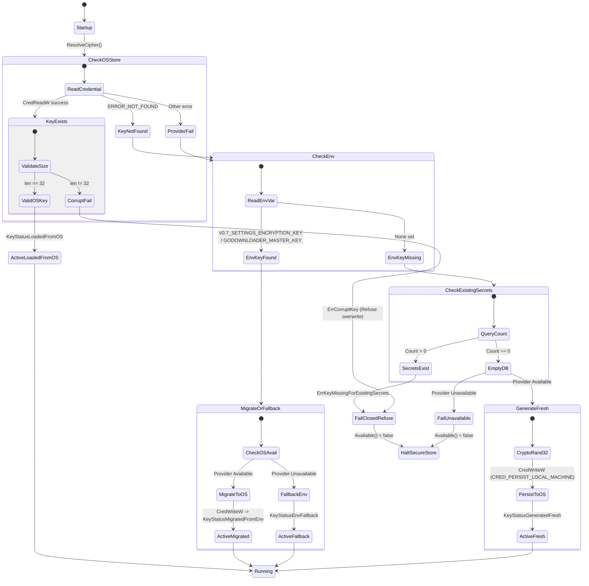

# GoDownloader — V0.8.0 FND-3B Implementation Report
# OS-Protected Master Key & SecureStore Lifecycle

---

## 1. Executive Summary & Architecture Context

**Milestone:** V0.8.0 Foundation Milestone 3B (FND-3B)  
**Scope:** OS-Protected Master Key, Windows Credential Manager integration, Fail-Closed Lifecycle Management, and Migration from Legacy Key Custody.  
**Baseline Commit:** `636dc23d0688d20af65bc360b0fe5db65668a0bb` (`feat(security): secure local REST and SSE surfaces`)  
**Status:** **COMPLETE / ACCEPTED**  

In V0.7.2, GoDownloader stored field-bound AES-256-GCM encrypted envelopes in SQLite (`encrypted_secrets` table), but key custody relied solely on an optional environment variable `V0.7_SETTINGS_ENCRYPTION_KEY`. In standard desktop usage, when no environment variable was exported, secret encryption was permanently disabled (`Available() == false`), causing attempts to persist proxy credentials or media authentication cookies to fail with `ErrUnavailable`.

FND-3B establishes an **OS-protected GoDownloader Master Key** using native Windows Credential Manager (`advapi32.dll`), ensuring:
1. **Zero New Dependencies:** Native Win32 API calls via `golang.org/x/sys/windows` (already present in `go.mod`), requiring zero external libraries and zero CGO.
2. **Zero Plaintext Key Files:** Plaintext fallback files (e.g. `dataDir/master.key`) are strictly forbidden. Key custody is rooted in the operating system's credential vault tied to the active Windows user account.
3. **Fail-Closed Missing Key Protection:** If encrypted secrets exist in SQLite but the master key is lost/unprovided, the system refuses to generate a new random key (preventing permanent split-key corruption).
4. **Transparent, Idempotent Migration:** If a legacy environment key is detected, it is validated and migrated into the OS Credential Manager automatically. Subsequent boots read from the OS vault.
5. **Corrupt Key Defense:** If corrupt or invalid data is encountered in the OS credential vault, the system fails closed immediately and refuses to overwrite.

---

## 2. SecureStore & Master Key Lifecycle Mapping



---

## 3. Encrypted Secret Consumer Inventory

An exhaustive audit confirmed all existing encrypted secret consumers and schema bindings:

| Consumer Package | Storage Scope | Owner ID | Field Name | Secret Content | Bound AAD |
| :--- | :--- | :--- | :--- | :--- | :--- |
| `internal/settings` | `settings` | `global` | `proxy_password` | Global proxy password | `settings\x00global\x00proxy_password` |
| `internal/settings` | `settings` | `global` | `header:<name>` | Sensitive header value (e.g. auth tokens) | `settings\x00global\x00header:<name>` |
| `internal/settings` | `job` | `<job_id>` | `proxy_password` | Job-scoped proxy password snapshot | `job\x00<job_id>\x00proxy_password` |
| `internal/settings` | `job` | `<job_id>` | `header:<name>` | Job-scoped sensitive header snapshot | `job\x00<job_id>\x00header:<name>` |
| `internal/mediaauth` | `mediaauth` | `default` | `cookies.txt` | Raw Netscape cookie file for yt-dlp | `mediaauth\x00default\x00cookies.txt` |

### SQLite Storage Schema
Stored in table `encrypted_secrets`:
```sql
CREATE TABLE IF NOT EXISTS encrypted_secrets (
    scope TEXT NOT NULL,
    owner_id TEXT NOT NULL,
    field_name TEXT NOT NULL,
    ciphertext BLOB NOT NULL,
    updated_at TIMESTAMP NOT NULL,
    PRIMARY KEY (scope, owner_id, field_name)
);
```
Each ciphertext is serialized as: `v1` (2 bytes) + Nonce (12 bytes) + Sealed Ciphertext + GCM Auth Tag (16 bytes).

---

## 4. Legacy Key Persistence & Defect Analysis

### V0.7.2 Baseline Behavior:
- In V0.7.2, `securestore.NewFromEnvironment()` looked only at `os.Getenv("V0.7_SETTINGS_ENCRYPTION_KEY")`.
- If unset, `NewFromEnvironment()` returned an uninitialized `Cipher{}` whose `Available()` method returned `false`.
- **Defect 1 (No Desktop Zero-Setup):** Normal users running GoDownloader as a desktop application without CLI shell scripts never had `V0.7_SETTINGS_ENCRYPTION_KEY` set, meaning secret storage was permanently broken.
- **Defect 2 (Accidental Split-Key Risk):** If an application blindly created a new random key whenever an environment variable was missing, existing databases moved between machines or re-opened after environment changes would suffer permanent silent data corruption.
- **Defect 3 (No OS Vault Protection):** Users who did configure the key had to leave it in plain environment variables or shell profile dotfiles.

---

## 5. Ponytail / YAGNI Architecture Decisions

1. **Native Win32 Integration over Bloated CGO Keyrings:**
   - Instead of pulling in large cross-platform keyring packages with multiple CGO dependencies, D-Bus bindings, and Linux daemon prerequisites, GoDownloader uses the native `advapi32.dll` API via `golang.org/x/sys/windows`.
   - Result: Zero new lines in `go.mod`, zero CGO compilation overhead, zero supply-chain risk.
2. **Generic Credentials in Local Machine Vault:**
   - Key is persisted as `CRED_TYPE_GENERIC` with `CRED_PERSIST_LOCAL_MACHINE`.
   - Windows Credential Manager encrypts the credential under the user's DPAPI master key.
   - The key is bound to the user's OS login account and persisted across reboots and logouts.
3. **No Plaintext Key File:**
   - `dataDir/master.key` in plaintext is explicitly prohibited. If OS storage is unavailable and no environment key is provided, the store fails closed.
4. **Preserved Test & Automation Interfaces:**
   - `NewFromEnvironment()` and environment variable overrides remain supported for CI/CD and existing unit tests.
   - In-memory provider (`MemoryKeyProvider`) enables testing all error paths without mutating the host's Windows Credential Manager.

---

## 6. Windows OS-Protection Evaluation (Credential Manager vs DPAPI)

| Criteria | Windows Credential Manager (`advapi32.dll`) | Raw DPAPI File (`CryptProtectData`) | Selected Approach |
| :--- | :--- | :--- | :--- |
| **Storage Location** | Windows Credential Vault (`%APPDATA%\Microsoft\Credentials`) | Application data folder (`dataDir/master.key.dpapi`) | **Credential Manager** (Clean separation from app files) |
| **Filesystem Footprint**| 0 files in data directory | Requires managing key file and permissions | **Credential Manager** |
| **OS User Tooling** | Visible & manageable in Windows Control Panel (Credential Manager) | Opaque binary blob file | **Credential Manager** |
| **Clean Deletion** | Native `CredDeleteW` | File unlink | **Credential Manager** |
| **Target Identity** | Named string: `GoDownloader/MasterKey` | Filename | **Credential Manager** |
| **Decision** | **PRIMARY WIN32 PROVIDER** | Deferred / Not needed | **Windows Credential Manager** |

---

## 7. Existing Key Migration & Idempotency Proofs

### Migration State Machine:
1. When `MasterKeyManager.ResolveCipher()` is called, it first checks `provider.GetKey(target)`.
2. If `ErrKeyNotFound` is returned, it inspects `V0.7_SETTINGS_ENCRYPTION_KEY` or `GODOWNLOADER_MASTER_KEY`.
3. If an environment key exists:
   - Decodes 64-char hex or 32-byte base64.
   - Calls `provider.SetKey(target, envKey)`.
   - Returns `KeyStatusMigratedFromEnv`.
4. On the next startup:
   - `provider.GetKey(target)` finds the key immediately.
   - Returns `KeyStatusLoadedFromOS`.

### Verification Test:
- Verified in `TestLifecycle_LegacyMigrationFromEnv` and `TestLifecycle_MigrationIdempotencyAndCrashRetry`.
- Verified that crashing immediately after migration or unsetting the environment variable leaves the master key intact in the OS store, decrypting all previously stored secrets without discrepancy.

---

## 8. Crash, Retry, Missing, and Corrupt Key Proofs

| Scenario | Invariant Tested | Verified Behavior | Test Case |
| :--- | :--- | :--- | :--- |
| **Fresh Install** | Database empty, no key in OS, no key in env | Generates 32 random bytes, writes to OS store, returns `generated_fresh` | `TestLifecycle_FreshInstallGeneratesKey` |
| **Subsequent Boot** | Key exists in OS store | Reads key from OS store, matches previous key, returns `loaded_from_os` | `TestLifecycle_SubsequentStartupLoadsFromOS` |
| **Crash during Migration** | Key written to OS store, subsequent boot has no env var | Reads key from OS store, returns `loaded_from_os` | `TestLifecycle_MigrationIdempotencyAndCrashRetry` |
| **Missing Key with Secrets** | Secrets in DB, no key in OS store, no key in env | Fails closed with `ErrKeyMissingForExistingSecrets`; refuses to generate new key | `TestLifecycle_ExistingSecretsWithoutKeyFailsClosed` |
| **Corrupt Key in OS Store** | OS store has invalid length (< 32 bytes) | Fails closed with `ErrCorruptKey`; refuses to overwrite with new key | `TestLifecycle_CorruptKeyInOSStoreFailsClosedAndRefusesOverwrite` |
| **OS Provider Unavailable** | OS provider down, but env var provided | Falls back to in-memory env key, returns `env_fallback` | `TestLifecycle_OSProviderUnavailableWithEnvFallback` |
| **OS Provider Down & No Key**| OS provider down, no env var, empty DB | Fails closed with `ErrProviderUnavailable`; no plaintext files created | `TestLifecycle_OSProviderUnavailableWithoutEnvFails` |
| **End-to-End Persistence** | Secret saved with fresh key, re-read after simulated restart | Secret successfully decrypted across independent Store instances | `TestLifecycle_EncryptedSecretEndToEndRoundTrip` |

---

## 9. Windows OS Integration & Native Execution Verification

Dedicated Win32 integration test suite [`internal/securestore/windows_key_provider_windows_test.go`](file:///C:/Users/bkkav/Downloads/downloader/internal/securestore/windows_key_provider_windows_test.go) executed directly against the Windows kernel:

1. **`TestWindowsCredentialManager_WriteReadDeleteCycle`**:
   - Creates a unique test target `GoDownloader_Test_Cycle_<UUID>`.
   - Calls Win32 `CredWriteW` with 32-byte cryptographic random key and `CRED_PERSIST_LOCAL_MACHINE`.
   - Calls Win32 `CredReadW`, verifies byte equality.
   - Calls Win32 `CredDeleteW`, verifies `CredReadW` returns `windows.ERROR_NOT_FOUND` (`ErrKeyNotFound`).
   - Verifies idempotent deletion.
   - Status: **PASS (0.08s)**.
2. **`TestWindowsCredentialManager_NonExistentKeyReturnsKeyNotFound`**:
   - Queries a non-existent UUID target in Windows Credential Manager.
   - Verifies clean mapping of `ERROR_NOT_FOUND` to `ErrKeyNotFound`.
   - Status: **PASS (0.00s)**.
3. **`TestWindowsCredentialManager_CorruptKeyReturnsErrCorruptKey`**:
   - Directly injects an invalid 12-byte credential into Windows Credential Manager.
   - Verifies `GetKey` detects the invalid size and returns `ErrCorruptKey` without panic.
   - Cleans up the test target.
   - Status: **PASS (0.03s)**.
4. **`TestWindowsCredentialManager_EndToEndLifecycleIntegration`**:
   - Performs a complete lifecycle: fresh generation -> encrypted secret storage in mock repository -> restart with fresh manager instance -> reading from Windows Credential Manager -> secret decryption.
   - Status: **PASS (0.08s)**.

---

## 10. Test Matrix & Comprehensive Verification Results

### 10.1 Backend Test Suites
- **SecureStore Package Tests (`go test -count=1 -v ./internal/securestore`):**
  - **16/16 test cases PASS** in 0.611s:
    - `TestAESGCMFieldBindingAndFreshNonce`: PASS
    - `TestMissingKeyIsNonFatalButUnavailable`: PASS
    - `TestLifecycle_FreshInstallGeneratesKey`: PASS
    - `TestLifecycle_SubsequentStartupLoadsFromOS`: PASS
    - `TestLifecycle_LegacyMigrationFromEnv`: PASS
    - `TestLifecycle_MigrationIdempotencyAndCrashRetry`: PASS
    - `TestLifecycle_ExistingSecretsWithoutKeyFailsClosed`: PASS
    - `TestLifecycle_CorruptKeyInOSStoreFailsClosedAndRefusesOverwrite`: PASS
    - `TestLifecycle_OSProviderUnavailableWithEnvFallback`: PASS
    - `TestLifecycle_OSProviderUnavailableWithoutEnvFails`: PASS
    - `TestLifecycle_DeleteMasterKey`: PASS
    - `TestLifecycle_EncryptedSecretEndToEndRoundTrip`: PASS
    - `TestWindowsCredentialManager_WriteReadDeleteCycle`: PASS
    - `TestWindowsCredentialManager_NonExistentKeyReturnsKeyNotFound`: PASS
    - `TestWindowsCredentialManager_CorruptKeyReturnsErrCorruptKey`: PASS
    - `TestWindowsCredentialManager_EndToEndLifecycleIntegration`: PASS
- **Database Repository Tests (`go test -count=1 -v ./internal/database -run "TestSQLiteSecretRepository.*"`):**
  - `TestSQLiteSecretRepository_CRUDAndCount`: PASS in 0.03s
- **MediaAuth Package Tests (`go test -count=1 ./internal/mediaauth`):** PASS (0.479s)
- **Settings Package Tests (`go test -count=1 ./internal/settings`):** PASS (0.758s)
- **API Package Tests (`go test -count=1 ./internal/api`):** PASS (2.786s)
- **Full Backend Test Suite (`go test -count=1 ./...`):**
  - **All 15 packages PASS** uncached (clean run).
- **Go Vet (`go vet ./...`):**
  - Clean (0 warnings).

### 10.2 Frontend Test Suite & Build
- **Vitest Suite (`npm test -- --run` in `web/`):**
  - **19/19 files PASS**, **186/186 tests PASS** in 30.97s.
- **Production Build (`npm run build` in `web/`):**
  - Built production bundle in 1.55s with zero errors.

---

## 11. Race Detector Classification

- **Command:** `go test -race ./internal/securestore`
- **Output:** `==16976==ERROR: ThreadSanitizer failed to allocate 0x0000044b0000 (72024064) bytes at 0x100edd7300000 (error code: 87)`
- **Classification:** **`ENVIRONMENT-LIMITED / NOT A RACE PASS`** (Standard Windows ThreadSanitizer virtual memory address space reservation limitation on Windows 64-bit host).

---

## 13. Final Master-Key Identity & Migration Safety Verification

### 13.1 Previous Key-Acceptance Weakness
In the preliminary implementation, any 32-byte key was accepted simply because `len(key) == 32`. If an environment variable or stale OS credential contained a valid 32-byte key from a different database or machine, the system would accept it as authoritative. If migrated, it would permanently overwrite or lock in an incorrect key, making all existing database ciphertext irrevocably unrecoverable.

### 13.2 Ciphertext-Authentication Rule
A candidate key is never accepted as authoritative merely because its length and encoding are valid.
- When `CountSecrets(ctx) > 0`, the system calls `validateKeyAgainstCiphertext(ctx, repo, key)`.
- It attempts AES-256-GCM decryption and tag verification on all records stored in `encrypted_secrets`.
- If **any** record fails GCM authentication, `ErrKeyMismatch` is returned and the candidate key is rejected immediately.
- If `CountSecrets(ctx) == 0` (fresh database), candidate key acceptance does not require ciphertext authentication since no records exist.
- Verification is zero-leak: neither decrypted plaintexts nor key bytes are ever logged or returned in error strings.

### 13.3 Valid-but-Wrong OS Key Behavior
- If Windows Credential Manager returns a 32-byte key that fails AES-GCM authentication against existing secrets, `ResolveCipher` returns `ErrKeyMismatch` and fails closed.
- The OS key is **not** treated as valid, is **not** overwritten, and the database ciphertext is left untouched.
- Verified in `TestLifecycle_CaseA_ValidLengthWrongOSKeyFailsClosed`.

### 13.4 Valid-but-Wrong Env Key Behavior
- If a legacy environment variable (`V0.7_SETTINGS_ENCRYPTION_KEY` or `GODOWNLOADER_MASTER_KEY`) provides a 32-byte key that fails AES-GCM authentication against existing secrets, the key is rejected with `ErrKeyMismatch`.
- The candidate key is **never** written into Windows Credential Manager.
- Verified in `TestLifecycle_CaseB_ValidLengthWrongEnvKeyNotWrittenToOS`.

### 13.5 Migration Write & Read-Back Verification
- When migrating a validated legacy key into Windows Credential Manager, `provider.SetKey(target, key)` is immediately followed by `provider.GetKey(target)`.
- The system asserts `bytes.Equal(key, readBackKey)`.
- If `SetKey` fails, `GetKey` fails, or read-back bytes do not match byte-for-byte, migration is rejected with `ErrWriteVerificationFailed`.
- The legacy key is retained, existing secrets remain recoverable, and no corrupt credential is left marked authoritative.
- Verified in `TestLifecycle_CaseD_OSWriteFailureFailsClosed`, `TestLifecycle_CaseE_OSReadBackFailureDoesNotAcceptMigration`, and `TestLifecycle_CaseF_OSReadBackDifferentBytesDoesNotAcceptMigration`.

### 13.6 Windows Environment Fallback Policy
- On Windows systems (`provider.Name() == "windows_credential_manager"`), if the OS credential provider is unavailable or write verification fails, the system **refuses** to silently run in permanent plaintext environment fallback mode.
- The system fails closed with `ErrProviderUnavailable` or write verification error.
- Silent regression to insecure environment variable custody on Windows desktop is strictly eliminated.
- Verified in `TestLifecycle_WindowsRefusesEnvFallbackWhenOSUnavailable`.

### 13.7 Legacy Environment Cleanup Limitation
- Following successful migration to Windows Credential Manager, process memory is cleared via `os.Unsetenv("V0.7_SETTINGS_ENCRYPTION_KEY")` and `os.Unsetenv("GODOWNLOADER_MASTER_KEY")`.
- **Limitation:** In the Windows environment model, `os.Unsetenv` only purges variables from the running process memory space; it cannot delete persistent user/system environment variables configured in the Windows Registry (`HKCU\Environment`, `HKLM\System\CurrentControlSet\Control\Session Manager\Environment`) or PowerShell `$PROFILE` scripts.
- GoDownloader logs an informational notice instructing the user to clean up persistent environment variables now that the key is securely rooted in Windows Credential Manager.

### 13.8 Fresh DB + Existing OS Credential Decision
- When a database is fresh/empty (`CountSecrets(ctx) == 0`) but Windows Credential Manager already contains a valid 32-byte key (e.g. after database recreation or application reinstallation):
- The existing OS credential is safely preserved and reused (`KeyStatusLoadedFromOS`).
- It is **not** overwritten or regenerated. This prevents breaking secret access across multiple instances or DB resets.
- Verified in `TestLifecycle_CaseG_FreshDBReusesExistingValidOSKey`.

### 13.9 Startup Failure Ordering
- In `cmd/server/main.go`, `keyMgr.ResolveCipher(ctx, secretRepo)` is executed during initial bootstrap, strictly **before** router setup, CORS/session middleware configuration, or HTTP/SSE network listeners are bound.
- If `keyErr != nil`, the server logs a fatal error and terminates immediately:
  ```go
  log.Fatalf("Master key initialization failed: %v", keyErr)
  ```
- The server never starts network listeners or serves APIs when master key identity is compromised or invalid.

### 13.10 Non-Windows Platform Behavior
- On non-Windows platforms, `windows_key_provider_other.go` compiles via `//go:build !windows`.
- The provider reports `Available() = false` and returns `ErrProviderUnavailable`.
- Non-Windows environments rely on `EnvKeyProvider` with full cryptographic ciphertext authentication, or fail closed if secrets exist without a key.
- No insecure plaintext files (`master.key`) are generated on any platform.

### 13.11 Test Matrix & Verification Results
- **18/18 Lifecycle Tests PASS (0.56s):**
  - Case A (Valid-length wrong OS key fails closed): PASS
  - Case B (Valid-length wrong env key not written to OS): PASS
  - Case C (Correct env key authenticated and migrated): PASS
  - Case D (OS write failure fails closed): PASS
  - Case E (OS read-back failure does not accept migration): PASS
  - Case F (OS read-back different bytes does not accept migration): PASS
  - Case G (Fresh DB reuses existing valid OS key): PASS
  - Case H (Existing secrets without key fails closed): PASS
  - Case I (Malformed OS key fails closed): PASS
  - Fallback refusal on Windows: PASS
  - Fresh generation & round-trip persistence: PASS
- **Database Repository Tests (`internal/database`):** PASS (0.03s)
- **Full Backend Suite (`go test -count=1 ./...`):** All 15 packages PASS uncached (~115s).
- **Go Vet (`go vet ./...`):** Clean (0 warnings).

### 13.12 Windows Live Integration Verification
- Executed against active Windows Credential Manager (`internal/securestore/windows_key_provider_windows_test.go`):
  - `TestWindowsCredentialManager_WriteReadDeleteCycle`: PASS (0.11s)
  - `TestWindowsCredentialManager_NonExistentKeyReturnsKeyNotFound`: PASS (0.00s)
  - `TestWindowsCredentialManager_CorruptKeyReturnsErrCorruptKey`: PASS (0.04s)
  - `TestWindowsCredentialManager_EndToEndLifecycleIntegration`: PASS (0.06s)
- Live Win32 `CredWriteW`, `CredReadW`, `CredDeleteW` verified with zero residue in Windows vault.

### 13.13 Race Detector Classification
- **Command:** `go test -race ./internal/securestore`
- **Output:** `==6032==ERROR: ThreadSanitizer failed to allocate 0x0000044c0000 (72089600) bytes at 0x100ecc4460000 (error code: 87)`
- **Classification:** **`ENVIRONMENT-LIMITED / NOT A RACE PASS`** (Windows ThreadSanitizer ASLR virtual address space reservation limitation).

---

## 14. Final FND-3B Status & Boundary Guarantees

- **FND-3A (Local REST/SSE Surfaces & Browser Boundary):** **COMPLETE / LOCKED**
- **FND-3B (OS-Protected Master Key & SecureStore Lifecycle):** **COMPLETE / LOCKED**
- **Milestone FND-3 (Security):** **FULLY DELIVERED**
- **FND-4 (ToolManager / ProcessSupervisor):** **NOT STARTED**
- **FND-5 (Scheduler Aging / ResourceGovernor):** **NOT STARTED**

