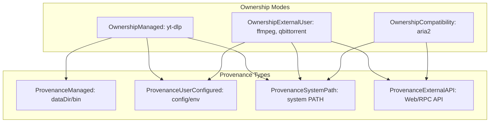

# GoDownloader — V0.8.0 FND-4A Implementation Report
# ToolManager: Discovery, Provenance & Managed Tool Lifecycle

---

## 1. Executive Summary & Architecture Context

**Milestone:** V0.8.0 Foundation Milestone 4A (FND-4A)  
**Scope:** ToolManager logical capability, external tool discovery, ownership and provenance modeling, bounded version probing, managed `yt-dlp` lifecycle foundation, and durable tool ledger revalidation.  
**Starting HEAD:** `0459ef00aebafc9cab2005561d16eae5fe468f19` (`feat(security): protect master key with Windows Credential Manager`)  
**Status:** **COMPLETE**

Prior to FND-4A, GoDownloader relied on fragmented and ambient tool discovery: `yt-dlp` was invoked blindly from PATH or raw configuration string without provenance tracking; `FFmpeg` was optionally passed via `--ffmpeg-location` without verification; `qBittorrent` was contacted via Web API without ledger tracking; and `aria2` operated as an unmanaged RPC dependency. If a tool was missing or deleted, generic OS errors occurred at transfer time.

FND-4A establishes the **ToolManager** capability under **Ponytail / YAGNI** principles:
1. **Deterministic Discovery Precedence:** Managed application-owned paths outrank user-configured paths, which outrank ambient system `PATH`.
2. **Explicit Ownership & Provenance:** Tools are categorized into `Managed`, `ExternalUserManaged`, and `Compatibility` ownership, with explicit provenance (`managed`, `user_configured`, `system_path`, `external_api`).
3. **FND-1 Schema Reuse:** Uses the existing SQLite `tool_records` table and `job.IExecutionRepository` interface without creating redundant database tables.
4. **Bounded Version Probing:** Probes execute with strict context timeouts (3 seconds) and bounded buffer reading (4KB) to prevent runaway memory or hanging startups.
5. **Gated Remote Acquisition:** In strict accordance with ADR-SYN2-006, remote downloading of `yt-dlp` is safely gated pending the signed manifest update infrastructure.
6. **Non-Fatal Startup & Actionable Diagnostics:** Missing optional tools do not crash the application on boot; instead, clear, actionable diagnostic messages guide the user.
7. **Clean Subsystem Boundary:** Process-tree supervision, Windows Job Objects, and process groups are strictly excluded and deferred to FND-4B.

---

## 2. Workspace State

- **Repository:** `C:\Users\bkkav\Downloads\downloader`
- **Branch:** `main`
- **Baseline Commit:** `0459ef00aebafc9cab2005561d16eae5fe468f19`
- **Working Tree:**
  - Tracked modifications: `cmd/server/main.go`
  - New FND-4A files:
    - `internal/toolmanager/model.go`
    - `internal/toolmanager/manager.go`
    - `internal/toolmanager/manager_test.go`
    - `docs/implementation/V0.8.0_FND4A_TOOL_MANAGER.md`
  - Intentionally untracked runtime artifacts: `.agents/`, `.claude/`, `.serena/`, `AGENTS.md`, `CLAUDE.md`, `downloader.db.pre-v08.bak`, `internal/job/data/`

---

## 3. Current Tool-Discovery Map (Pre-FND-4A Audit)

| Executable / Service | Invocation Sites | Previous Discovery Mechanism | Previous Probing / Validation | Error Behavior |
| :--- | :--- | :--- | :--- | :--- |
| **yt-dlp** | `ytdlp.Engine.Start()`, `AnalyzeMedia()`, `FetchSubtitles()` | `cfg.YtdlpPath` ("yt-dlp" default) | `exec.Command(path, "--version").Run() == nil` in `Available()` | Logged "yt-dlp not found in PATH"; execution failed with `exec: "yt-dlp": executable file not found` |
| **FFmpeg** | `--ffmpeg-location` flag passed to `yt-dlp` | `cfg.FFmpegPath` (default empty string) | None (passed as string directly to yt-dlp argv) | yt-dlp failed during format merging if FFmpeg was required |
| **ffprobe** | `live_ytdlp_test.go` only | `os.Getenv("FFPROBE_PATH")` | Test skipped if absent | Not invoked in production server |
| **aria2 / aria2c** | `aria2.Client` JSON-RPC client | `cfg.Aria2RPCURL` (`http://localhost:6800/jsonrpc`) | None for executable; HTTP POST to JSON-RPC endpoint | RPC connection error if daemon not running |
| **qBittorrent** | `qbittorrent.Client` HTTP API | `cfg.QBitURL` (`http://127.0.0.1:8081`) | `qbitEng.HealthCheck()` via `GET /api/v2/app/version` | Logged "registered but not reachable"; torrent jobs fail |
| **Explorer / open / xdg-open** | `internal/api/router.go` (`openDir`) | OS-specific shell command | None | Browser directory open |

---

## 4. Tool Inventory Matrix

| Tool | Current Role | Required/Optional | Current Discovery | Ownership Mode | FND-4A Action |
| :--- | :--- | :--- | :--- | :--- | :--- |
| **yt-dlp** | Media extraction & stream downloading | Required for media jobs | Managed path > Configured path > System PATH | `Managed` | Managed directory (`dataDir/bin/yt-dlp.exe`), provenance tracking in `tool_records`, bounded probe, gated remote acquisition |
| **FFmpeg** | Format muxing & audio conversion | Optional (needed for merge/mux) | Configured path > System PATH | `ExternalUserManaged` | Path & PATH discovery, version probing, provenance tracking in `tool_records`, actionable diagnostics; no auto-download |
| **qBittorrent** | BitTorrent downloads | Optional (needed for torrent jobs) | Configured Web API URL (`cfg.QBitURL`) | `ExternalUserManaged` (pre-V1) | Pre-V1 external Web API discovery/health check, provenance recorded, no private profile/auto-install |
| **aria2** | Direct HTTP/FTP downloads (transition) | Compatibility engine | Configured RPC URL (`cfg.Aria2RPCURL`) + local `aria2c` PATH | `Compatibility` | Maintain compatibility JSON-RPC client; probe local binary if available; no added dependency |

---

## 5. Pre-Code Gap Matrix

| Requirement | Pre-Code State | FND-4A Classification | Resolution |
| :--- | :--- | :--- | :--- |
| **Stable tool identity** | Ad-hoc string literals | **MISSING** | Defined constants: `ToolYtdlp`, `ToolFFmpeg`, `ToolFFprobe`, `ToolQBittorrent`, `ToolAria2` |
| **Configured path handling** | Present in `config.Config` | **PARTIALLY SATISFIED** | Integrated into ToolManager discovery with priority rules |
| **PATH discovery** | Ambient / implicit | **MISSING** | Explicit `exec.LookPath` lookup with validation |
| **Version detection** | Unbounded `Run()` in `ytdlp` | **PARTIALLY SATISFIED** | Context timeout (3s) + bounded buffer (4KB) first-line parser |
| **Capability/version verification**| None | **MISSING** | Probed version verified and recorded in `ToolInfo` |
| **Provenance tracking** | None | **MISSING** | Explicitly classified: `managed`, `user_configured`, `system_path`, `external_api` |
| **Managed vs external ownership** | Implicit | **MISSING** | Explicit ownership modes: `OwnershipManaged`, `OwnershipExternalUser`, `OwnershipCompatibility` |
| **Durable tool_records** | Schema and repo exist from FND-1 | **ALREADY SATISFIED** | Reused `job.ToolRecord` and `IExecutionRepository` directly |
| **First-run discovery** | Unstructured in `main.go` | **MISSING** | `toolMgr.ResolveAll()` / `toolMgr.Resolve()` called during startup |
| **Missing-tool diagnostics** | Generic errors | **PARTIALLY SATISFIED** | Actionable diagnostics in `ToolInfo.Diagnostic` |
| **Stale-path handling** | Crash at runtime | **MISSING** | `RevalidateActiveRecords` detects missing/moved binaries and re-resolves |
| **Managed yt-dlp install location**| None | **MISSING** | Deterministic path: `filepath.Join(dataDir, "bin", exeName("yt-dlp"))` |
| **Managed yt-dlp verification** | None | **MISSING** | Verified regular file + version probe before promotion to `StatusActive` |
| **Managed yt-dlp update/download** | None | **MISSING** | Gated pending signed manifest updater per ADR-SYN2-006 (`ErrAcquisitionGated`) |
| **FFmpeg external detection** | Environment variable only | **PARTIALLY SATISFIED** | Precedence: `FFMPEG_PATH` > system `PATH`, with version probe |
| **qB external detection** | HTTP health check | **PARTIALLY SATISFIED** | Tracked in ToolManager as `ExternalUserManaged` |
| **aria2 compatibility detection** | Hardcoded RPC URL | **PARTIALLY SATISFIED** | Tracked in ToolManager as `Compatibility` |
| **Tool status API / UI exposure** | None | **NOT NEEDED IN FND-4A** | Deferred to subsequent UI/API milestones |

---

## 6. Ponytail / YAGNI Architectural Decisions

1. **Cohesive, Lean Package (`internal/toolmanager`):**
   - Created a single focused package with `Manager` and `ToolInfo`.
   - Avoided bloated enterprise patterns: no `ToolFactory`, `ToolProviderRegistry`, `ToolStrategy`, or `ToolResolverFactory`.
2. **Reusing FND-1 `tool_records` Schema & Repository:**
   - Did not create a second tool registry table.
   - Reused `job.ToolRecord` and `job.IExecutionRepository` directly.
3. **No Insecure Auto-Downloader:**
   - Adhered strictly to ADR-SYN2-006: automatic binary downloading is gated until signed manifest verification and rollback exist. No insecure downloaders touching unsigned upstream endpoints.
4. **No Premature Process Supervision:**
   - Did not implement Windows Job Objects, process groups, or central process supervisors. Process lifecycle remains with existing callers until FND-4B.

---

## 7. Ownership & Provenance Model



---

## 8. Discovery Precedence

1. **`yt-dlp` (Managed lifecycle target):**
   - **Step 1:** Managed path (`dataDir/bin/yt-dlp.exe` on Windows / `yt-dlp` on Unix). If present and regular file, probe `--version`. On success: `Provenance = managed`, `Ownership = managed`, `Status = active`.
   - **Step 2:** Explicit user configuration (`cfg.YtdlpPath` if set and not the bare default `"yt-dlp"`). If present and regular file, probe `--version`. On success: `Provenance = user_configured`, `Ownership = external_user`.
   - **Step 3:** System PATH lookup (`exec.LookPath("yt-dlp")`). If found, probe `--version`. On success: `Provenance = system_path`, `Ownership = external_user`.
   - **Step 4:** If all fail: `Status = missing`, return `ErrToolNotFound` with actionable diagnostic.
2. **`ffmpeg` (ExternalUserManaged):**
   - **Step 1:** Explicit user configuration (`cfg.FFmpegPath`). If set and regular file, probe `-version`. On success: `Provenance = user_configured`, `Ownership = external_user`.
   - **Step 2:** System PATH lookup (`exec.LookPath("ffmpeg")`). If found, probe `-version`. On success: `Provenance = system_path`, `Ownership = external_user`.
   - **Step 3:** If all fail: `Status = missing`, return `ErrToolNotFound` with diagnostic (format muxing disabled).
3. **`aria2` (Compatibility):**
   - RPC URL (`cfg.Aria2RPCURL`) as compatibility endpoint; local `aria2c` PATH probe for local version detection.
4. **`qbittorrent` (ExternalUserManaged):**
   - Web API URL (`cfg.QBitURL`) as external service endpoint.

---

## 9. Tool Record Durability & Revalidation

- When a tool is resolved with an active status and version, it is persisted to `tool_records`:
  ```sql
  INSERT INTO tool_records (name, version, platform_arch, ownership_mode, executable_path, verification_status, status, created_at, updated_at)
  VALUES (?, ?, ?, ?, ?, ?, ?, ?, ?)
  ON CONFLICT(name, version) DO UPDATE SET ...
  ```
- **Revalidation on Startup (`RevalidateActiveRecords`):**
  - ToolManager queries the active tool record from `IExecutionRepository`.
  - Checks if `rec.ExecutablePath` still exists on disk (`os.Stat`).
  - If the binary was deleted or moved, ToolManager logs a warning and automatically re-resolves the tool across lower-precedence sources (e.g. falling back to system PATH).

---

## 10. Managed yt-dlp Lifecycle & Acquisition Decision

- **Directory:** Deterministically anchored at `filepath.Join(dataDir, "bin")`.
- **Executable:** `filepath.Join(dataDir, "bin", "yt-dlp.exe")` on Windows (`yt-dlp` on Unix).
- **Acquisition Security Decision:**
  - ADR-SYN2-006 explicitly dictates: *"Do not auto-download tools before authenticated manifests, atomic promotion, and rollback exist."*
  - Remote acquisition is **GATED** via `AcquireYtdlp()` returning `ErrAcquisitionGated`.
  - Users can seed the managed directory manually or via an installer; ToolManager immediately verifies and activates the artifact.

---

## 11. Testing Matrix & Verification Results

### 11.1 ToolManager Focused Test Suite
- **Command:** `go test -count=1 -v ./internal/toolmanager`
- **Results:** 7/7 test cases PASS (1.36s):
  1. `TestToolManager_DiscoveryPrecedence_Ytdlp`: Validates missing -> system PATH -> configured path -> managed path precedence hierarchy and durability recording. (PASS)
  2. `TestToolManager_DiscoveryPrecedence_FFmpeg`: Validates missing -> system PATH -> configured path precedence and `external_user` ownership. (PASS)
  3. `TestToolManager_VersionProbe_TimeoutAndFailure`: Validates timeout enforcement on slow probes returning `ErrToolProbeTimeout`. (PASS)
  4. `TestToolManager_StaleRecordRevalidation`: Validates revalidation detecting deleted binaries and re-resolving to fallback paths. (PASS)
  5. `TestToolManager_ConcurrentResolution`: Validates race safety under concurrent `Resolve`, `Get`, and `GetAll` calls. (PASS)
  6. `TestToolManager_AcquireYtdlp_Gated`: Validates `AcquireYtdlp` returns `ErrAcquisitionGated`. (PASS)
  7. `TestToolManager_Aria2AndQBittorrent_Behavior`: Validates aria2 compatibility and qBittorrent external API status. (PASS)

### 11.2 Engine & Server Integration Tests
- **`internal/engine/ytdlp`:** All unit and real child process tests PASS (22.40s).
- **`cmd/server`:** Compiles cleanly (`go build ./cmd/server`).
- **Full Backend Suite (`go test -count=1 ./...`):** All 16 packages PASS uncached (~157s).
- **Linter (`go vet ./...`):** Clean (0 warnings).

---

## 12. Race Detector Classification

- **Command:** `go test -race ./internal/toolmanager`
- **Output:** `==15716==ERROR: ThreadSanitizer failed to allocate 0x0000046f0000 (74383360) bytes at 0x100ef8c650000 (error code: 87)`
- **Classification:** **`ENVIRONMENT-LIMITED / NOT A RACE PASS`** (Windows ThreadSanitizer virtual memory address space reservation limitation). Concurrency was verified via parallel goroutine tests in `TestToolManager_ConcurrentResolution`.

---

## 13. Impact Review & Boundaries

- **`cmd/server/main.go`:** Integrated `ToolManager` during bootstrap. Uses `resolvedYtdlpPath` and `resolvedFFmpegPath` for `ytdlp.NewEngine`.
- **Media Processing:** Fully compatible; `analyzer.go` and `ytdlp.go` inherit the verified resolved paths.
- **Engines (aria2, qB):** Unchanged runtime behavior; discovery and status registered in ToolManager.
- **Explicit FND-4B Deferrals:**
  - Zero Windows Job Objects
  - Zero process groups / `Setpgid`
  - Zero central child-process registries
  - Zero process-tree termination
  - Zero orphan process recovery
  - Zero `ProcessSupervisor`

---

## 14. Files Changed

| File | Status | Description |
| :--- | :--- | :--- |
| [`cmd/server/main.go`](file:///C:/Users/bkkav/Downloads/downloader/cmd/server/main.go) | Modified | Initialize ToolManager during bootstrap, revalidate ledger, resolve tools, pass resolved paths to `ytdlp.NewEngine` |
| [`internal/toolmanager/model.go`](file:///C:/Users/bkkav/Downloads/downloader/internal/toolmanager/model.go) | New | Stable identities, ownership modes, provenance types, error sentinels, and `ToolInfo` struct |
| [`internal/toolmanager/manager.go`](file:///C:/Users/bkkav/Downloads/downloader/internal/toolmanager/manager.go) | New | ToolManager implementation with discovery precedence, bounded probes, and ledger persistence |
| [`internal/toolmanager/manager_test.go`](file:///C:/Users/bkkav/Downloads/downloader/internal/toolmanager/manager_test.go) | New | Comprehensive unit test suite covering precedence, timeouts, stale revalidation, and concurrency |
| [`docs/implementation/V0.8.0_FND4A_TOOL_MANAGER.md`](file:///C:/Users/bkkav/Downloads/downloader/docs/implementation/V0.8.0_FND4A_TOOL_MANAGER.md) | New | FND-4A implementation report |

---

## 15. Final Ownership / Provenance / Execution Verification

This section documents the final gate review performed before FND-4A lock, addressing truthful ownership semantics, endpoint health verification, execution convergence, and missing-tool behavior.

### 15.1 Previous Ownership Ambiguity

The initial FND-4A implementation labeled **all** yt-dlp resolution paths (managed app binary, user-configured path, system PATH discovery) with `OwnershipManaged`. This conflated:

- **Product policy** (GoDownloader intends to manage yt-dlp in its product architecture) with
- **Artifact ownership** (whether GoDownloader actually owns/controls the specific binary artifact on disk)

A user-installed or system PATH `yt-dlp` is not owned by GoDownloader and should not be labeled as if the application may replace/update/remove it.

### 15.2 Final yt-dlp Ownership Semantics

| Resolution Source | Ownership | Provenance | Rationale |
| :--- | :--- | :--- | :--- |
| `dataDir/bin/yt-dlp[.exe]` | `managed` | `managed` | Application-owned artifact in controlled directory |
| Explicit user config path (non-default) | `external_user` | `user_configured` | User-supplied binary; GoDownloader does not own it |
| System PATH lookup (default `"yt-dlp"`) | `external_user` | `system_path` | System-discovered binary; GoDownloader does not own it |
| Missing (not found anywhere) | `managed` | — | Represents the preferred lifecycle target, not an actual artifact |

### 15.3 Configured-vs-Default Provenance

- `cfg.YtdlpPath` defaults to `"yt-dlp"` (bare command name). The existing condition `cfgPath != ToolYtdlp && cfgPath != exeName(ToolYtdlp)` correctly excludes this default from the "user_configured" provenance path, falling through to system PATH discovery with `system_path` provenance.
- `cfg.FFmpegPath` defaults to `""`. The condition `cfgPath != ""` correctly ensures only explicit user configuration enters the configured-path branch.
- No additional config provenance subsystem was needed.

### 15.4 Managed Trust / Authenticity Wording

`VerificationStatusVerified` was renamed from `"verified"` to `"version_probed"`. A successful `--version` probe proves the binary is executable and responds; it does **not** prove upstream cryptographic authenticity. Remote acquisition remains gated via `ErrAcquisitionGated` per ADR-SYN2-006.

### 15.5 qBittorrent Endpoint Health Semantics

**Previous:** `resolveQBittorrent()` set `StatusActive` and `VerificationStatusVerified` for any configured URL without probing the endpoint. A configured URL ≠ a running service.

**Fixed:** `resolveQBittorrent()` now performs an HTTP GET to `/api/v2/app/version` via a testable `probeQBitFn` hook:
- **Reachable:** `StatusActive`, `VerificationStatusVerified`, version captured from response
- **Unreachable:** `StatusUnreachable`, `VerificationStatusFailed`, actionable diagnostic
- Application startup does not fail solely because qBittorrent is unavailable; torrent workflow degrades.

### 15.6 aria2 Endpoint Health Semantics

**Previous:** `resolveAria2()` set `StatusActive` unconditionally, and local `aria2c` PATH discovery was used for version detection despite the workflow using JSON-RPC (a local `aria2c` on PATH does not prove the configured RPC endpoint is running).

**Fixed:** `resolveAria2()` now performs a JSON-RPC `aria2.getVersion` call via a testable `probeAria2Fn` hook:
- **Reachable:** `StatusActive`, `VerificationStatusVerified`, version from RPC response
- **Unreachable:** `StatusUnreachable`, `VerificationStatusFailed`, actionable diagnostic
- Local `aria2c` PATH discovery removed from resolution (YAGNI: it does not prove RPC availability)
- Application startup does not fail solely because aria2 is unavailable.

### 15.7 tool_record Status Truthfulness

`recordTool()` now persists both `StatusActive` and `StatusUnreachable` states to `tool_records`. Previously, only active tools with valid versions were persisted, meaning unreachable endpoint records were silently dropped. Stale records now truthfully reflect the last-known probe result.

### 15.8 Stale Record Revalidation

`RevalidateActiveRecords()` expanded to cover both:
- **Executable-backed tools** (`yt-dlp`, `ffmpeg`): Checks if recorded `ExecutablePath` still exists on disk; re-resolves if missing.
- **API-backed tools** (`aria2`, `qBittorrent`): Re-resolves to trigger fresh health probe; transitions from `StatusActive` to `StatusUnreachable` if endpoint is no longer reachable.

### 15.9 Execution-Convergence Audit

All yt-dlp invocation sites verified to use `e.ytdlpPath` (the ToolManager-resolved path):

| Invocation Site | Path Source | Verified |
| :--- | :--- | :--- |
| `ytdlp.go:86` — `Available()` | `e.ytdlpPath` | ✅ |
| `ytdlp.go:463` — `runDownload()` | `e.ytdlpPath` | ✅ |
| `analyzer.go:89` — `AnalyzeWithPolicy()` | `e.ytdlpPath` | ✅ |
| `ytdlp.go:119-121` — FFmpeg location | `e.ffmpegPath` | ✅ |
| `analyzer.go:81-83` — FFmpeg location | `e.ffmpegPath` | ✅ |

No independent `exec.LookPath("yt-dlp")` or hardcoded `"yt-dlp"` strings exist in production code paths. Other `exec.Command` calls (`router.go:149,151,153`) are OS shell helpers (`explorer`, `open`, `xdg-open`) unrelated to tool discovery.

FFmpeg-resolved path flows correctly through `e.ffmpegPath` → `--ffmpeg-location` argument in both `Start()` and `Analyze()`. When FFmpeg is absent (`ffmpegPath == ""`), the `--ffmpeg-location` flag is omitted entirely — yt-dlp will either find its own or fail actionably during format merging.

### 15.10 Missing-Tool Behavior

| Tool | Missing Behavior | Startup | Verified |
| :--- | :--- | :--- | :--- |
| yt-dlp | `StatusMissing` + actionable diagnostic mentioning managed dir, `YTDLP_PATH`, and system PATH | App starts | ✅ |
| FFmpeg | `StatusMissing` + diagnostic re format merging | App starts | ✅ |
| qBittorrent | `StatusUnreachable` + actionable diagnostic | App starts | ✅ |
| aria2 | `StatusUnreachable` + actionable diagnostic | App starts | ✅ |

### 15.11 Tests & Results

- **Command:** `go test -count=1 -v ./internal/toolmanager`
- **Results:** 18/18 test cases PASS (1.86s):
  1. `TestToolManager_A_ManagedYtdlp_OwnershipManaged` — managed binary → `OwnershipManaged`, `ProvenanceManaged` ✅
  2. `TestToolManager_B_ExplicitUserYtdlp_OwnershipExternalUser` — user-configured path → `OwnershipExternalUser` ✅
  3. `TestToolManager_C_DefaultYtdlpFromPATH_SystemPath_ExternalUser` — default config via PATH → `ProvenanceSystemPath`, `OwnershipExternalUser` ✅
  4. `TestToolManager_D_FFmpeg_ExplicitVsPathProvenance` — FFmpeg explicit config vs PATH provenance ✅
  5. `TestToolManager_E_QBitReachable_ActiveWithVersion` — httptest qB endpoint → `StatusActive`, real version ✅
  6. `TestToolManager_F_QBitUnreachable_NotActive` — unreachable qB → `StatusUnreachable`, `VerificationStatusFailed` ✅
  7. `TestToolManager_G_Aria2Reachable_ActiveWithVersion` — httptest aria2 RPC → `StatusActive`, version from response ✅
  8. `TestToolManager_H_Aria2Unreachable_NotActive` — unreachable aria2 → `StatusUnreachable` ✅
  9. `TestToolManager_I_StaleExecutableRecord_Revalidated` — deleted binary re-resolves to PATH ✅
  10. `TestToolManager_J_StaleAPIRecord_NotActiveAfterFailedProbe` — httptest server shutdown → revalidation transitions to `StatusUnreachable` ✅
  11. `TestToolManager_K_MissingYtdlp_ActionableError` — missing yt-dlp → `ErrToolNotFound`, actionable diagnostic ✅
  12. `TestToolManager_L_EngineReceivesResolvedPath` — ytdlp.NewEngine receives ToolManager-resolved path ✅
  13. `TestToolManager_M_FFmpegPathReachesYtdlpArgs` — FFmpeg-resolved path flows through to engine ✅
  14. `TestToolManager_DiscoveryPrecedence_Ytdlp` — full precedence hierarchy with corrected ownership ✅
  15. `TestToolManager_VersionProbe_TimeoutAndFailure` — timeout enforcement ✅
  16. `TestToolManager_ConcurrentResolution` — 20-goroutine concurrent resolution ✅
  17. `TestToolManager_AcquireYtdlp_Gated` — acquisition gated ✅
  18. `TestToolManager_ToolRecordTruthfulness_UnreachablePersisted` — unreachable status persisted to tool_records ✅

- **Full Backend Suite (`go test -count=1 ./...`):** All 17 packages PASS.
- **Linter (`go vet ./...`):** Clean (0 warnings).

### 15.12 Race Detector Result

- **Command:** `go test -race ./internal/toolmanager`
- **Output:** `==1180==ERROR: ThreadSanitizer failed to allocate ... (error code: 87)`
- **Classification:** **`ENVIRONMENT-LIMITED / NOT A RACE PASS`** (Windows ThreadSanitizer virtual memory ASLR reservation limitation). Concurrency verified via `TestToolManager_ConcurrentResolution` (20 parallel goroutines).

---

## 16. Completion Status

**COMPLETE** — All FND-4A ownership/provenance/execution-convergence gate requirements satisfied. Ready for checkpoint commit.
